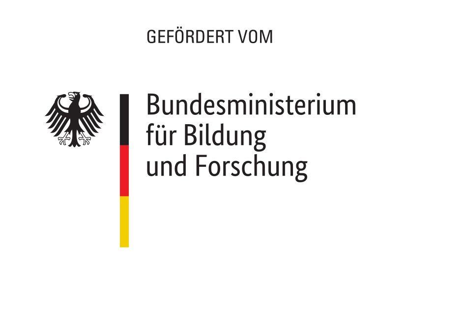

# Kommentare.vis.one

Explaining machine learning and natural language processing at the example of news comments.

Background: https://github.com/jfilter/ptf-kommentare

## Installation

- Make sure you have `idyll` installed (`npm i -g idyll`).
- Clone this repo and run `npm install`.

## Devlopment

```bash
idyll
```

## Deployment

```bash
bash deploy.sh
```

## License

MIT.

## Sponsoring

This work was funded by the German [Federal Ministry of Education and Research](https://www.bmbf.de/en/index.html).


